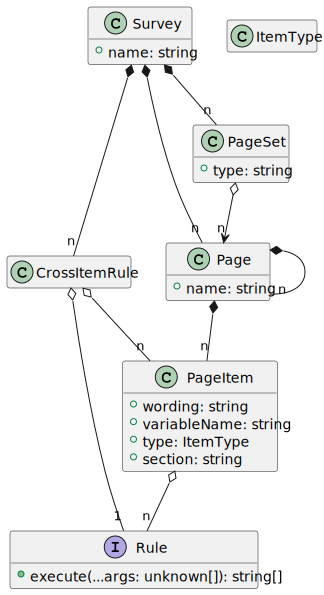
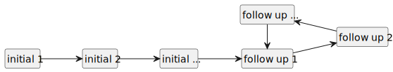

# U-ASK Domain Model

U-ASK domain model classes and builders. This library implement an internal domain specific language as described in [Martin Fowler's Domain Specific Languages](https://martinfowler.com/dsl.html).

This library is intended to be used with [U-ASK Management System](https://github.com/u-ask/uask-sys#readme) and [U-ASK Web Application](https://github.com/u-ask/uask-app#readme).

 - [Install](#install)
 - [Survey](#survey-construction)
 - [Rules](#rules)
 - [Workflows](#workflows)
 - [Participant](#participant-construction)
 - [Mutations](#domain-model-objects-mutations)
 - [DSL reference](#dsl-reference)


# Install
```bash
npm Install uask-dom
```

# Usage

## `Survey` construction

A `Survey` is composed of `Page` objects. `Page` objects are hierarchical, they include other `Page` objects or `PageItems` leaf objects.

`Page` objects are grouped in `PageSet` objects that represent questionnaires. A `Survey` may have multiple questionnaires.

`PageItem` represent a question, they have a `wording` and a `type`. They may be involved in `Rule` objects that control the value of question answers.



`Survey` objects are complex graphes, construction is easier with fluent builders :

```ts
import { builder } from "uask-dom"

const b = builder();

b.survey("First-Survey")
  .pageSet("Questionnaire").pages("Questions");

b.page("Questions")
  .question("Ok?", "OK", b.types.yesno)
  .question("When:", "WHEN", b.types.date());

const survey = b.build();
```

The result is a `Survey` object with `PageSet`, `Page` and `PageItem` objects that reflects the stucture of the fluent program above.

The complete refercence for survey buiders is [below](#dsl-reference)

## Rules
A `PageItem` may be the target or a `Rule`. For example a page item can enforce that a value must be provided.
```ts
b.page("Questions")
  .question("Ok?", "OK", b.types.yesno)
  .required()
  // ...
```

A `PageItem` value can have a default value :
```ts
b.page("Questions")
  // ...
  .question("When:", "WHEN", b.types.date())
  .defaultValue("@TODAY");
```

Rules are executed in order of appearance of their target `PageItem` in the DSL ; for a given target they are executed in order of deacreasing precedence.

| rule name        | description                          | parameters                       | precedence
|:-----------------|:-------------------------------------|:---------------------------------|-----------:
| copy             | copy another item value, unit, etc.  | variable name                    |        110
| computed         | cacluate the value from other items  | formula                          |        100
| defaultValue     | the value when the item is activated | value*                           |        100
| critical         | fires an event when item is valued   | event*, message, values*         |         70
| required         | requires a value when enforced       | formula?                         |         70
| activateWhen     | activate the item on condition       | variableName, values OR formula  |         50
| decimalPrecision | the number of decimal digits         | precision                        |         10
| inRange          | must be between given min and max    | min*, max*, limits               |         10
| letterCase       | enforce lower or upper case          | "upper" OR "lower"               |         10
| fixedLength      | the exact number of characters       | length                           |         10
| maxLength        | the max number of characters         | length                           |         10

_note:_ parameters followed by a * may be replaced by a formula, a formula is constructed wih the `computed` keyword:

```ts
b.page("Questions")
  // ...
  .question("When:", "WHEN", b.types.date())
  .inRange("2022-01-01", b.computed("@TODAY"));
```

A critical rule fires an event that will be notified to users which workflow subscribed to that event (see [Derived workflows](#derived-workflows)).

```ts
b.page("Questions")
  // ...
  .question("When:", "WHEN", b.types.date())
  .critical("before_2022", "before 2022", b.computed("WHEN < #2022-01-01#"));
```

## Workflows
A `Survey` has one or more `Workflow` objects. A workflow represents the page sets a user has access to and when he can create an interview related to a given page set.

### Main workflow
In the main workflow a page set may :
  - appear once or multiple times
  - belong to the sequence or be auxiliary
  - terminate the workflow (or not)
  
The workflow sequence follows the following stucture:



The fisrt interview of a participant always refercences the starting page set. Subsequent interviews will reference pages sets in order defined in the sequence. Initial page sets appears in only one interview and follow up page sets can be repeated in multiple interviews, always following the sequence.

Terminal page sets terminate the workflow: no more interview could be created for the participant.

Auxiliary page sets can appear any time after the sequence started.

`Workflow` creation is part of `Survey` construction:

```ts
import { builder } from "uask-dom"

const b = builder();

b.survey("First-Survey")
  .pageSet("Initial 1").pages("I1")
  .pageSet("Initial 2").pages("I2")
  .pageSet("Follow up 1").pages("F1")
  .pageSet("Follow up 2").pages("F2")
  .pageSet("Terminal 1").pages("T1")
  .pageSet("Terminal 2").pages("T1")
  .pageSet("Auxiliary 1").pages("A1")
  .pageSet("Auxiliary 2").pages("A2")

//...

b.workflow()
  .initial("Initial 1", "Initial 2")
  .followUp("Follow up 1", "Follow up 2")
  .terminal("Terminal 1", "Terminal 2")
  .auxiliary("Auxiliary 1", "Auxiliary 2")

const survey = b.build();
```

### Derived workflows
Derived workflows are built from the main workflow, giving access to a restricted subset of the page sets. They have the same sequence, terminal and auxiliary page sets.

Derived workflows can optionally have associated notifications. Notifications refers to critical events declared with a question. Users with that workflow will receive notifications when the event fires.

A derived workflow is identified by its name (which can not be `"main"`), and optionally a specifier. Names are not restricted in this library but in [U-ASK Management System](https://github.com/u-ask/uask-sys#readme) the allowed values are :
 - `writer`
 - `reader`
 - `administrator`
 - `superadministrator`
 - `developer`
The specifier if any, is positionned after the name, separated with `:` (e.g. `"writer:investigator"`, `"reader:coordinator"`).

```ts
// ...

b.workflow("writer:investigator")
  .withPageSets("Follow up 1", "Follow up 2")
  .notify("special")
```

## `Participant` construction

A `Participant` participes to a `Survey` ; it belongs to a `Sample`.

`Participant` contains `Interview` objects that reference a `PageSet` and contains `InterviewItem` objects.

`InterviewItem` holds a value and represent an answer to a `PageItem` (a question).

`Participant` may also be build using fluent buiders.

The following code builds a `Participant` with code `"11A"` in the given sample of the given survey. The participant will have one interview, corresponding to page set `"Questionnaire"` with two answers, for items corresponding to variables `"OK"` and `"WHEN"`.
```ts
import { ParticipantBuilder } from "uask-dom";

const builder = new ParticipantBuilder(survey, "11A", sample);
builder.interview("Questionnaire")
  .item("OK").value(false)
  .item("WHEN").value(new Date());
const participant = builder.build();
```

the same can be done using domain model objects instead of string identifiers:
```ts
import { ParticipantBuilder } from "uask-dom";

const questionnaire: PageSet = //...
const Ok: PageItem = //...
const When: PageItem = //...

const builder = new ParticipantBuilder(survey, "11A", sample);
builder.interview(questionnaire)
  .item(Ok).value(false)
  .item(When).value(new Date())
const participant = builder.build();
```

See [./src/example/index.ts]() for an example of fluent builders usage.

## Domain model objects mutations

Domain model objects are mostly immutable. When a domain model object needs an update in some business logic, a new version of the object is produced :

```ts
const pageItem = new PageItem("Are you OK ?", "OK", QuestionTypes.yesno);
const interviewItem = new InterviewItem(pageItem, true);
//...
const updatedInterviewItem = interviewItem.update({ value: false });
```

Domain object collections are also immutable, if a new version of an object has been produced, a new collection including the new object must be created :

```ts
const interviewItems = DomainCollection(interviewItem, ...);
//...
const updatedInterviewItems = interviewItems.update(
  a => a == interviewItem ? updatedInterviewItem : a
);
```

Mutations on `Patient`, `Interview` and `InterviewItem` can be achieved using the corresponding builders. The following snippet will created and updated version the `participant`, with items corresponding to variables `"OK"` and `"WHEN"` updated in interview corresponding do page set `Questionnaire` and identified by the nonce `11145786`.

```ts
import { ParticipantBuilder } from "uask-dom";

const participant: Patient = //...

const builder = new ParticipantBuilder(survey, participant)
builder.interview("Questionnaire", 11145786)
  .item("OK").value(false)
  .item("WHEN").value(new Date())
const updatedPatient = builder.build();
```

The same can be done with domain models instead of string identifiers :
```ts
import { ParticipantBuilder } from "uask-dom";

const participant: Patient = //...
const questionnaire11145786: Interview = //...
const Ok: PageItem = //...
const When: PageItem = //...

const builder = new ParticipantBuilder(survey, participant)
builder.interview(questionnaire11145786)
  .item(Ok).value(false)
  .item(When).value(new Date())
const updatedPatient = builder.build();
```

# DSL reference

## Survey and visit construction

| instruction                           |                |
|:--------------------------------------|:---------------|
|`.survey(name)`                         | creates a survey with given name
| &emsp; `.options(opt)`                | declares options for the survey
| &emsp; `.visit(name)`                 | creates a page set (or visit) with given name
| &emsp;&emsp; `.translate(lang, name)` | add a translation for visit name
| &emsp;&emsp; `.dateVariable(name)`    | declares the variable which holds the visit date
| &emsp;&emsp; `.pages(names...)`       | adds pages with given names to the visit
| |
| `.mandatory(name)`                    | declares that a page is mandatory in a visit, result is passed to `.pages` 

### Survey options

| option          | default value   |                    |
|:----------------|:----------------|:-------------------|
|`languages`      | `['en', 'fr']`  | languages supported by the survey
|`defaultLang`    | `'en'`          | fallback language if browser language is not supported
|`showFillRate`   | `true`          | show fill rate for visits
|`visitDateVar`   | `'VDATE'`       | default variable that holds the visit date
|`phoneVar`       | `'__PHONE'`     | participant phone number if any
|`emailVar`       | `'__EMAIL'`     | participant email if any
|`inclusionVar`   | `'__INCLUDED'`  | variable that holds whether the participant is included or not
|`unitSuffix`     | `'_UNIT'`       | suffix used for exporting data units if applicable

###### Example
```ts
b.survey('Demo-eCRF')
  .defaultLang('fr')
  .visit('INCL')
    .translate('fr', 'Inclusion')
    .translate('en', 'Inclusion')
    .dateVariable('DATE_VIS')
    .pages(b.mandatory('PATIENT_INFO'), 'ANTECED')
```

## Page and question construction

| instruction                                         |                |
|:--------------------------------------------------  |:---------------|
|`.page(name)`                                        | creates a page with given name
| &emsp; `.translate(lang, name)`                     | adds a translation for page name
| &emsp; `.startSection(name)`                        | declares a section with given name
| &emsp;&emsp; `.translate(lang, name)`               | adds a translation for section name
| &emsp; `.question(wording, variable, types...)`     | adds a question with given wording, variable and types (type can change with context, see below)
| &emsp;&emsp; `.translate(lang, wording)`            | adds a translation for question wording
| &emsp;&emsp; `.comment(info)`                       | adds information about the variable
| &emsp;&emsp;&emsp; `.translate(lang, info)`         | adds a translation for question comment
| &emsp;&emsp; `.unit(units...)`                      | declares that the variable value may be expressed in one of the given units
| &emsp;&emsp;&emsp; `.extendable()`                  | declares that custom units may be used for the variable
| &emsp;&emsp; `.defaultValue(value)`                 | declares that a new variable instance is filled with given value
| &emsp;&emsp; `.required()`                          | declares that the variable cannot be filled by a special value
| &emsp;&emsp; `.decimalPrecision(precision)`         | decrares that the variable is a number with at most given precision decimal digits
| &emsp;&emsp; `.inRange(min, max, limits)`           | decrares that the variable value must be between given values, limits may or may not be included (see below)
| &emsp;&emsp; `.maxLength(length)`                   | decrares that the variable value is a text which lenght is at most given length
| &emsp;&emsp; `.fixedLength(length)`                 | decrares that the variable value is a text which lenght is exactly given length
| &emsp;&emsp; `.letterCase(case)`                    | decrares that the variable value is a text which case is 'upper' or 'lower'
| &emsp;&emsp; `.computed(formula)`                   | apply the given formula to the variable
| &emsp;&emsp; `.critical(event, message, values...)` | fires the event when the item receives the given values
| &emsp;&emsp; `.critical(event, message, formula)`   | fires the event when the formula is true
| &emsp;&emsp; `.visibleWhen(formula, results...)`    | shows this question only when the given formula is true or if any equal to one of the given results
| &emsp;&emsp; `.activatedWhen(formula, results...)`  | activates this question only when the given formula is true or if any equal to one of the given results
| &emsp;&emsp; `.modifiableWhen(formula, results...)` | allows modifications on this question only when the given formula is true or if any equal to one of the given results
| &emsp; `.question(variable, types...)`              | adds a question with given variable and types (type can change with context, see below), allow multiple wordings
| &emsp;&emsp; `.wordings(wordings...)`               | adds multiple, contextual wordings (see below)
| &emsp;&emsp; `.translate(lang, wordings...)`        | adds a translation for multiple wordings
| &emsp; `.include(name)`                             | includes all the question of the given page
| &emsp;&emsp; `.context(variable, num)`              | switch included variable to context num (i.e. with corresponding wording and type if multiple are declared)
| &emsp;&emsp; `.context(num)`                        | switch all included variables to context num (i.e. with corresponding wording and type if multiple are declared)
| &emsp;&emsp; `.visibleWhen(formula, results...)`    | shows the included questions only when the given formula is true or if any equal to one of the given results
| &emsp;&emsp; `.activatedWhen(formula, results...)`  | activates the included questions only when the given formula is true or if any equal to one of the given results
| &emsp;&emsp; `.modifiableWhen(formula, results...)` | allows modifications on the included questions only when the given formula is true or if any equal to one of the given results
| |
| `.computed(formula)`                                | declares a dynamic constraint, result is passed `inRange`, `activatedWhen`, etc. 
| `.copy(variable)`                                   | declares a copy an existing variable values, result is passed `defaultValue`
| `.includeLimits`                                    | declares that an in range constraint must include limits, result is passed to `inRange`
| `.includeUpper`                                     | declares that an in range constraint must include upper limit, result is passed to `inRange`
| `.includeLower`                                     | declares that an in range constraint must include lower limit, result is passed to `inRange`

### Variable types
The third argument of `.question(wording, variable, type)` is the result of one of


| instruction                                         | Variable type  |
|:--------------------------------------------------  |:---------------|
|`.types.acknowledge`                                 | true or undefined
|`.types.yesno`                                       | Yes or No (translated to user language)
|`.types.integer`                                     | a natural number
|`.types.real`                                        | a real number
|`.types.text`                                        | a text
|`.types.info`                                        | no value
|`.types.date(incomplete?, month?)`                   | a date optionally incomplete and truncted to month
|`.types.scale(min, max)`                             | an integer value between min and max
|`.types.score(scores...)`                            | an integer that is used to compute scores
|&emsp;`.wording(lang, wordings...)`                  | declares wording for scores
|&emsp;`.translate(lang, wordings...)`                | adds a translation for score wordings
|`.types.choice('one' | 'many', choices...)`          | a set of categories that can be exclusive (`one`) or not (`many`)
|&emsp;`.wording(lang, wordings...)`                  | declares wording for categories
|&emsp;`.translate(lang, wordings...)`                | adds a translation for category wordings
|`.types.glossary('one' | 'many', choices...)`        | a set of categories that allows custom values and can be exclusive (`one`) or not (`many`)
|&emsp;`.wording(lang, wordings...)`                  | declares wording for categories
|&emsp;`.translate(lang, wordings...)`                | adds a translation for category wordings

###### Example
```ts
b.page('INCL')
  .translate('fr', 'Inclusion')
  .translate('en', 'English')
  .question('Date de la visite', 'DATE_VIS', b.types.date())
    .translate('en', 'Visit date')
    .required()
    .inRange('#2000-01-01#', b.computed('@TODAY'))
  .question('Sexe', 'SEX',
    b.types.choice('one', 'H', 'F', 'ND')
      .wording('Homme', 'Femme', 'Non déterminé')
      .translate('en', 'Male', 'Female', 'Undetermined'))
    )
    .translate('en', 'Sex')
```

## Computed formulas
A formula are composed of :

 - operators

 | operator         |                          |
 |:-----------------|:-------------------------|
 |`+ - * /`         | arithmetic operators
 |`< > <= >= == !=` | comparison operators
 |`? ... : ...`     | ternary operator
 |`&& || == !=`     | logical operators
 |`(...)`           | sub expressions

 - values

 | value            |                          |
 |:-----------------|:-------------------------|
 | `0, 1, 2 ...`    | numbers (may be decimals)
 |`'...'`or `"..."` | texts
 |`#YYYY-MM-DD#`     | dates

 - variables

 | variable         |                          |
 |:-----------------|:-------------------------|
 | `X, Y, Z ...`    | current value of a variable declared in the questions
 | `$X, $Y, $Z ...` | previous value of a variable declared in the questions
 | `@LASTIN`        | last input date for the participant
 | `@UNDEF`         | undefined value
 | `@ACK`           | acknowledged or true value
 | `@THISYEAR`      | current year
 | `@TODAY`         | current date

 - functions

 | function          |                          |
 |:------------------|:-------------------------|
 | `~IN(VAR, value)` | returns `@ACK` if given variable of type `.choice('many')` contains the given value
 
###### Examples
```ts
b.page('...')
 .question('Où souffrez-vous ?', 'LOC', b.types.choice('many', 'MAIN', 'DOS', 'JAMBE', 'TÊTE', 'AUTRE')
 .question('Si AUTRE, précisez', 'LOC_AUTRE', b.types.text)
   .activatedWhen(~IN('LOC, "Autre")')
```
```ts
b.page('...')
  question('Date de la visite', 'DATE_VIS', b.types.date())
 .question('Confirmez que la date est postérieure à ce jour', '__DATE_POST', b.types.acknowledge)
   .required()
   .visibleWhen('DATE_VIS>@TODAY')
```

## Question layouts
Questions that are related may be viewed as tables or recordsets

A table represents variables that can be arranged as

>|      | column A | colmumn B |
>|:-----|:---------|:----------|
>| row1 | A1       | B1
>| row2 | A2       | B2

A recordset represents variables that can have multiple instances in the same form

>| column A | colmumn B |
>|:---------|:----------|
>| A(1)     | B(1)
>| A(2)     | B(2)
>| ...      | ...

This is achieved by using DSL syntax in the question wordings :

| wording            | layout  |
|:-------------------|:--------|
| `row -> column`    | table
| `-> column`        | recordset
| `-> row -> column` | a table nested in a recordset

###### Examples
```ts
b.page('...')
  .question('Red cells -> Result', 'RES_BLOOD', b.types.real)
  .question('Red cells -> Interpretation', 'INT_BLOOD', b.choice('one', 'normal', 'abnormal'))
  .question('Haemoglobin -> Result', 'RES_BLOOD', b.types.real)
  .question('Haemoglobin -> Interpretation', 'INT_HAEMO', b.choice('one', 'normal', 'abnormal'))
```

>|                     | Résult    | Interpretation 
>|:--------------------|:----------|:---------------
>| **Red cells**       | RES_BLOOD | INT_BLOOD
>| **Haemoglobin**     | RES_BLOOD | INT_HAEMO

```ts
b.page('...')
  .question('-> Year', 'YEAR', b.types.integer)
  .question('-> Treatment', 'TREAT', b.types.text)
  .question('-> Dosage', 'DOS', b.types.text)
```

>| YEAR    | Treatment | Dosage 
>|:--------|:----------|:------
>| YEAR(1) | TREAT(1)  | DOS(1)
>| YEAR(2) | TREAT(2)  | DOS(2)
>| ...     | ...       | ...     

## Informationnal classes and directives
The question comments can be used to add information to a question.
Directives gives richer wording capabilities and classes are question categories indications.
Comment can be written as : `directives...{classes...}`. Classes begins with a dot `.`

| directive or class            |        |
|:------------------------------|:-------|
| `(...)`                       | simple information
| <code><... &vert; ...></code> | left and right labels
| `.row`                        | the categories should be disposed on a row
| `.column`                     | the categories should be disposed on a column
| `.pad` or `.pad1`             | pad the question on the left
| `.pad2`                       | pad the question on the left with 2 levels
| `.pad3`                       | pad the question on the left with 3 levels
| `.no-specials`                | the field won't be modifiable, thus do not display specials

###### Example
```ts
b.page(' ')
 .question('Pain scale', 'PAIN', b.types.scale(1, 10))
 .comment('<No pain | Maximum pain>{.row}')
```

> Pain scale<br/>
> &emsp; No pain &nbsp; 1 &emsp; 2 &emsp; 3 &emsp; 4 &emsp; 5 &emsp; 6 &emsp; 7 &emsp; 8 &emsp; 9 &emsp; 10 &nbsp; Maximum pain

