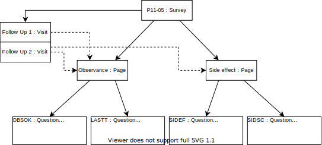
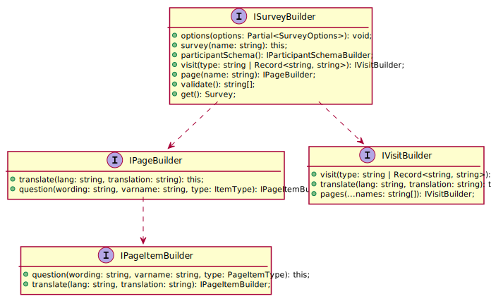
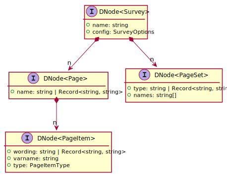

# Internal DSL builder



The survey object hierarchy described by the picture above is be built using a fluent API.

## Fluent API
The `builder` method returns an object that implements `ISurveyBuilder` interface which allows to build a survey by chaining methods. Other building interface are involved such as `IPageBuilder` or `IVisitBuilder` which are also fluent.
The following code example declares and build a more advanced survey object :

```typescript
import builder from "spiral"

const b = builder();

b.options({
  defaultLang: "en",
});

b.survey("P11-05")
  .pageSet("Inclusion").pages("General", "Risks", "Symptoms")
  .pageSet("Follow Up").pages("General", "Symptoms", "Status", "Side effects");

b.page("General").translate("fr", "Général")
  .question("Visit date :", "VDATE", b.types.date)
    .translate("fr", "Date de la visample");

b.page("Risks").translate("fr", "Risques")
  .question("Is the participant exposed to gases, fumes, vapors, dust ?", "EXP", b.types.yesno)
    .translate("fr", "Le participant est-il exposé à des gaz, fumées, vapeurs, poussières")
  .question("Is the participant a smoker ?", "SMOKE", b.types.yesno)
    .translate("fr", "Le participant est-il fumeur ?")
  .question("If yes, since when ?", "SMOWHEN", b.types.date)
    .translate("fr", "Si oui depuis quand ?");

b.page("Symptoms").translate("fr", "Symptomes")
  .question("Dyspnea", "DYSP", b.types.scale(1, 5))
    .translate("fr", "Dyspnée")
  .question("Cough", "COUGH", b.types.yesno)
    .translate("fr", "Toux");

b.page("Status").translate("fr", "Statut")
  .question("Status of the malignancy", "MALSTATUS", b.types.choice(
      "one",
      "Completely recovery",
      "Recovering",
      "Remission",
      "Ongoing"
    )
  )
  .translate("fr", "Statut de la tumeur");

b.page("Side effects").translate("fr", "Effets secondaires")
  .question("Other side effects that have been experienced ?", "SIDEF", b.types.text)
    .translate("fr", "D'autres effets secondaires ont-ils été ressentis ?")
  .question("Pain scale rating :", "SIDSC", b.types.scale(1, 5))
    .translate("fr", "Evaluation sur l'échelle de douleur :");

const survey = b.build();
```
The Builders API is represented in the following interface diagrams :



## Validation
Under the hood, builders implements another familly of interfaces that represent an abstract syntax tree of the internal DSL : `DNode<Survey>`, `DNode<Page>`, `DNode<PageSet>`. Validation functions are written following the pattern :

```typescript
function validateSomething(root: DNode<Survey>, messages: string[]) {
  // navigate through the tree using the IXxxNode API's to perform validation
  // push messages in the the given array if validation fails
  // eventually return the validated objects
}
```

For instance the following function validates that at one or more pages that contain a question for the configurated visit date variable exist and returns them :
```typescript 
export function validateDatePagesExist(root: DNode<Survey>, messages: string[]): IPageNode[] {
  const page1 = root.pageNodes.filter(p =>
    p.questionNodes.find(q => q.varname == root.config.visitDateVar)
  );
  if (page1.length == 0) {
    messages.push(
      `question with visit date variable '${root.config.visitDateVar}' is missing`
    );
  }
  return page1;
}
```
The tree structure is represented by the following interfaces, which structure is closely related to the Builder's API shown above :


## Operational model
Builders are also used for operational model, i.e. `Participant`, `Interview`, `Awnser` classes. Operational model objects are subject to modifications, thus the builders are also used to build modified version of an existing objects.

For example, the following code creates a `Participant` object to add an interview related to the visit represented by `visit` instance.
```typescript
const participant = new ParticipantBuilder(survey, "0001", sample);
  .interview(visit)
  .get();
```

And the code bellow modifies the participant and the interview to add items :
```typescript
const updatedParticipant = new ParticipantBuilder(survey, participant);
  .interview(visit)
    .items([{question1: "Yes"}, {question2: 41}])
  .get();
```

Builders garantie that the object reference is unchanged if there is no modifications. For example, the following code does not create a new `Participant` object :
```typescript
const updatedParticipant2 = new ParticipantBuilder(survey, updatedParticipant);
  .interview(visit)
    .items([{question2: 43 - 2}])
  .get()
// updatedParticipant2 == updatedParticipant
```

## Helper API
In order to write builders efficiently an helper API is available.

For example, the followin code builds a new collection by merging two collections `items1` and `items2`. The merge is done for `InterviewItem` objects with the same `question` property. The `result` contains :
 - `InterviewItem` objects in `items1` that does not exist or are not modified in `items2` (current objects)
 - a new version of `InterviewItem` objects in `items1` that are modified in `items2` (modified objects)
 - `InterviewItem` objects in `items` that does not exist in `items` (new objects)
 
```typescript
import { merge } from "../domain";

const result = merge(items1, items2)
  .on((a1, a2) => a1.question == a2.question)
  .insertAll();
```

The following variant do not insert new `InterviewItem` objects that have an undefined value :

```typescript
const result = merge(items1, items2)
  .on((a1, a2) => a1.question == a2.question)
  .insert(a => typeof a.value != "undefined");
```

The last variant does not insert new `InterviewItem` objects :

```typescript
const result = merge(items1, items2)
  .on((a1, a2) => a1.question == a2.question)
  .updateOnly();
```