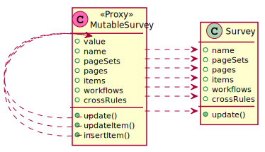

# Mutation helpers

## Survey mutations


The `MutableSurvey` helper class in `util` module exposes methods that simulate survey mutation by transforming an underlying `Survey` mutable field.



`MutableSurvey` implements the same interface as `Survey` thanks to the `DomainProxy` method.

```ts
export class MutableSurvey {
  constructor(public value: Survey) {
    return DomainProxy(this, value);
  }
  
  //...
}
```

The mutators replace the inner `Survey` field with a new object :

```ts
class MutableSurvey implements Survey {
  //...
  
  update(kwargs: Partial<Survey>) {
    this.value = this.value.update(kwargs);
    return this;
  }

  updateItem(page: Page, index: number, item: Partial<PageItem>) {
    //...
    return this.update({ pageSets, pages, crossRules, workflows });
  }
  
  //...
}
```